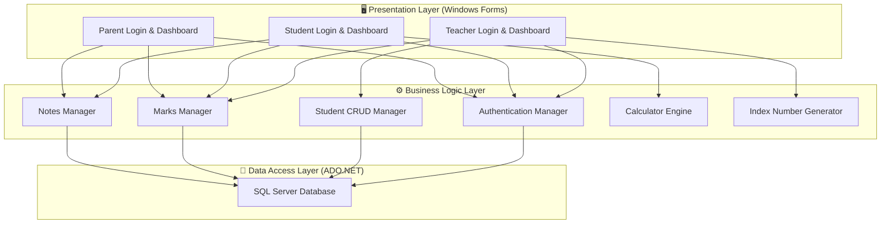
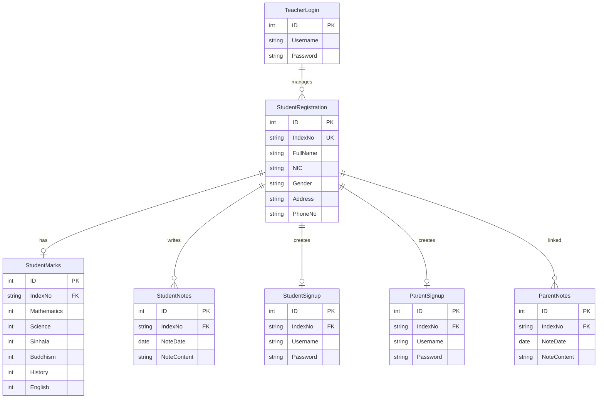

<div align="center">


<br/>

[](LICENSE)
[]()
[]()
[]()
[]()

**A desktop-based student management system with role-based access for Teachers, Students, and Parents.**
**Built with C# Windows Forms and Microsoft SQL Server.**

</div>

---

## 📋 Table of Contents

- [Overview](#-overview)
- [Features](#-features)
- [Tech Stack](#-tech-stack)
- [Architecture](#-architecture)
- [Database Schema](#-database-schema)
- [Getting Started](#-getting-started)
- [Screenshots](#-screenshots)
- [Project Structure](#-project-structure)
- [Roadmap](#-roadmap)
- [License](#-license)

---

## 🔍 Overview

The **Student Management System** is a comprehensive Windows desktop application developed as the final project for the IT Diploma program at ESOFT Metro Campus. It provides a complete solution for managing student records, academic marks, and user authentication with three distinct user roles.

### 🎯 Problem Statement

Schools and educational institutions face challenges with:
- Manual, paper-based student registration
- Difficulty tracking student academic performance
- Lack of separate access portals for teachers, students, and parents
- No centralized system for notes and communication

### 💡 Solution

A role-based desktop application that digitizes student management:
- **Teachers** can register students, manage records (CRUD), and enter academic marks
- **Students** can view their marks, calculate grades, and manage personal notes
- **Parents** can monitor their child's academic progress and maintain notes

---

## ✨ Features

<div align="center">

| 👨‍🏫 **Teacher Portal** | 🎒 **Student Portal** | 👨‍👩‍👧 **Parent Portal** |
|---|---|---|
| Student Registration (CRUD) | View Academic Marks | View Child's Marks |
| Auto-generated Index Numbers | Total & Percentage Calculator | Personal Notes (CRUD) |
| Search Students by Index No | Built-in Calculator Tool | Contact Information |
| Enter Subject Marks | Personal Notes (CRUD) | Secure Login |
| Data Grid View | Secure Login & Signup | Signup via Index Verification |

</div>

### Key Highlights

- 🔐 **Role-Based Authentication** — Separate login portals for Teacher, Student, and Parent
- 📝 **Full CRUD Operations** — Create, Read, Update, Delete student records
- 🔢 **Auto Index Number Generation** — Automatic sequential index number assignment (`SIst000001`, `SIst000002`...)
- 📊 **Academic Progress Tracking** — View marks for Mathematics, Science, Sinhala, Buddhism, History, English
- 📱 **Index Number Verification** — Students/Parents must verify their index number before signup
- 🧮 **Built-in Calculator** — Addition, Subtraction, Multiplication, Division, Percentage
- 📓 **Notes System** — Date-based notes with Save, Search, and Delete functionality
- ✅ **Input Validation** — NIC number validation, phone number validation, gender selection checks
- 🔒 **Password Security** — Show/hide password toggle with system password characters

---

## 🛠️ Tech Stack

<div align="center">

| Layer | Technology | Purpose |
|---|---|---|
| **Language** |  | Application logic |
| **Framework** |  | Runtime framework |
| **UI** |  | Desktop GUI |
| **Database** |  | Data storage |
| **ORM** |  | Database connectivity |
| **IDE** |  | Development environment |

</div>

---

## 🏗️ Architecture



---

## 🗄️ Database Schema

The system uses **7 database tables** for complete data management:



---

## 🚀 Getting Started

### Prerequisites

- **Visual Studio 2019+** (Community Edition or higher)
- **Microsoft SQL Server 2017+** (Express Edition works)
- **SQL Server Management Studio (SSMS)** — for database setup
- **.NET Framework 4.7+** runtime

### Installation

```bash
# 1. Clone the repository
git clone https://github.com/ShelumHansana/Student-Management-System.git
cd Student-Management-System
```

### Database Setup

1. Open **SQL Server Management Studio (SSMS)**
2. Connect to your SQL Server instance
3. Create a new database named `StudentManagementDB`
4. Run the SQL scripts in the `/Database` folder (if available), or create the tables using the schema above
5. Update the connection string in the project:

```csharp
// Update in your connection string configuration
string connectionString = "Data Source=YOUR_SERVER;Initial Catalog=StudentManagementDB;Integrated Security=True";
```

### Running the Application

1. Open `StudentManagementSystem.sln` in **Visual Studio**
2. Restore NuGet packages if prompted
3. Set the startup project
4. Press **F5** or click **Start** to run

### Default Credentials

| Role | Username | Password |
|---|---|---|
| Teacher | `admin` | `admin123` |

> **Note:** Students and Parents must register via the signup form after verifying their index number.

---

## 📸 Screenshots

> **📌 Coming Soon** — Screenshots of each portal will be added here.

<!--
Uncomment and add your screenshots:

<div align="center">

### Teacher Portal


### Student Portal


### Parent Portal


</div>
-->

---

## 📁 Project Structure

```
Student-Management-System/
├── Database/
│   └── setup.sql              # Database creation scripts
├── Properties/
│   └── AssemblyInfo.cs        # Assembly metadata
├── Resources/
│   └── images/                # UI icons & backgrounds
├── Forms/
│   ├── LoginForm.cs           # Main login selection
│   ├── TeacherLogin.cs        # Teacher authentication
│   ├── TeacherDashboard.cs    # Student CRUD & marks entry
│   ├── StudentLogin.cs        # Student authentication
│   ├── StudentSignup.cs       # Student registration
│   ├── StudentDashboard.cs    # Marks view & calculator
│   ├── ParentLogin.cs         # Parent authentication
│   ├── ParentSignup.cs        # Parent registration
│   ├── ParentDashboard.cs     # Child progress view
│   ├── Calculator.cs          # Built-in calculator
│   └── Notes.cs               # Notes management
├── Helpers/
│   ├── DatabaseHelper.cs      # ADO.NET database operations
│   ├── ValidationHelper.cs    # Input validation utilities
│   └── IndexGenerator.cs      # Auto index number logic
├── App.config                 # Connection string & settings
├── Program.cs                 # Application entry point
├── StudentManagementSystem.sln # Solution file
└── README.md
```

---

## 🗺️ Roadmap

- [x] Role-based authentication (Teacher, Student, Parent)
- [x] Student registration with CRUD operations
- [x] Auto-generated index numbers
- [x] Subject marks entry & viewing
- [x] Built-in calculator
- [x] Personal notes system
- [x] Input validation (NIC, phone, etc.)
- [ ] Export reports to PDF/Excel
- [ ] Grade calculation & GPA system
- [ ] Email notifications to parents
- [ ] Attendance tracking module
- [ ] Migrate to WPF for modern UI

---

## 📄 License

This project is licensed under the **MIT License** — see the [LICENSE](LICENSE) file for details.

---

<div align="center">

**Built with ❤️ by [Shelum Hansana](https://github.com/ShelumHansana)**

*IT Diploma Final Project — ESOFT Metro Campus*


</div>
