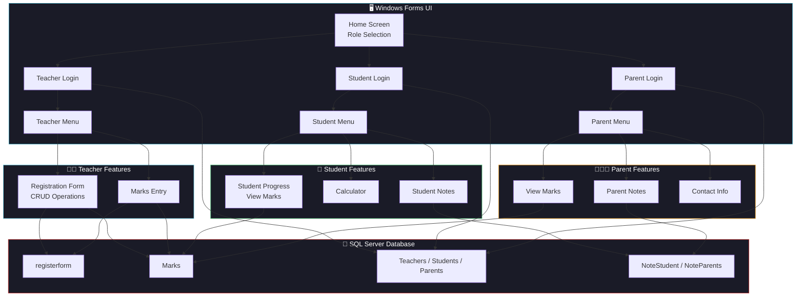

<div align="center">


<br/>

[](LICENSE)
[]()
[]()
[]()
[]()

**A desktop-based student management system with role-based access for Teachers, Students, and Parents.**
**Built with C# Windows Forms and Microsoft SQL Server.**

</div>

---

## 📋 Table of Contents

- [Overview](#-overview)
- [Features](#-features)
- [Tech Stack](#-tech-stack)
- [Architecture](#-architecture)
- [Database Schema](#-database-schema)
- [Getting Started](#-getting-started)
- [Project Structure](#-project-structure)
- [Screenshots](#-screenshots)
- [Roadmap](#-roadmap)
- [License](#-license)

---

## 🔍 Overview

The **Student Management System** is a comprehensive Windows desktop application developed as the final project for the IT Diploma program at ESOFT Metro Campus. It provides a complete solution for managing student records, academic marks, and user authentication with three distinct user roles.

### 🎯 Problem Statement

Schools and educational institutions face challenges with:
- Manual, paper-based student registration
- Difficulty tracking student academic performance
- Lack of separate access portals for teachers, students, and parents
- No centralized system for notes and communication

### 💡 Solution

A role-based desktop application that digitizes student management:
- **Teachers** can register students, manage records (CRUD), and enter academic marks
- **Students** can view their marks, calculate grades, and manage personal notes
- **Parents** can monitor their child's academic progress and maintain notes

---

## ✨ Features

<div align="center">

| 👨‍🏫 **Teacher Portal** | 🎒 **Student Portal** | 👨‍👩‍👧 **Parent Portal** |
|---|---|---|
| Student Registration (CRUD) | View Academic Marks | View Child's Marks |
| Auto-generated Index Numbers | Total & Percentage Calculator | Personal Notes (CRUD) |
| Search Students by Index No | Built-in Calculator Tool | Contact Information |
| Enter Subject Marks | Personal Notes (CRUD) | Secure Login |
| Data Grid View | Secure Login & Signup | Signup via Index Verification |

</div>

### Key Highlights

- 🔐 **Role-Based Authentication** — Separate login portals for Teacher, Student, and Parent
- 📝 **Full CRUD Operations** — Create, Read, Update, Delete student records
- 🔢 **Auto Index Number Generation** — Automatic sequential index number assignment (SIst000001, SIst000002...)
- 📊 **Academic Progress Tracking** — View marks for Mathematics, Science, Sinhala, Buddhism, History, English
- 📱 **Index Number Verification** — Students/Parents must verify their index number before signup
- 🧮 **Built-in Calculator** — Addition, Subtraction, Multiplication, Division, Percentage
- 📓 **Notes System** — Date-based notes with Save, Search, and Delete functionality
- ✅ **Input Validation** — NIC number validation, phone number validation, gender selection checks
- 🔒 **Password Security** — Show/hide password toggle with system password characters

---

## 🛠️ Tech Stack

<div align="center">

| Layer | Technology | Purpose |
|---|---|---|
| **Language** |  | Application logic |
| **Framework** |  | Runtime framework |
| **UI** |  | Desktop GUI |
| **Database** |  | Data persistence |
| **IDE** |  | Development environment |

</div>

---

## 🏗️ Architecture



---

## 💾 Database Schema

The application uses **Microsoft SQL Server** with the database `sh2002` containing the following tables:

| Table | Purpose | Key Columns |
|---|---|---|
| `registerform` | Student registration records | IndexNo, NameinFull, NameWithInitials, Birthday, Gender, ParentName, NICnumber, ContactNo, TelNo, MobNo, Address |
| `Marks` | Academic marks storage | IndexNo, Mathematics, Science, Sinhala, Buddhism, History, English |
| `Teachers` | Teacher credentials | username, password |
| `Students` | Student credentials | username, password |
| `Parents` | Parent credentials | username, password |
| `NoteStudent` | Student notes | Date, Note |
| `NoteParents` | Parent notes | Date, Note |

---

## 🚀 Getting Started

### Prerequisites

- **Visual Studio 2019+** (with .NET Desktop Development workload)
- **Microsoft SQL Server** (Express or Developer edition)
- **SQL Server Management Studio (SSMS)** — for database setup
- **.NET Framework 4.7.2+**

### Database Setup

1. Open **SQL Server Management Studio**
2. Create a new database named `sh2002`
3. Execute the following SQL to create required tables:

```sql
-- Student Registration Table
CREATE TABLE registerform (
    IndexNo VARCHAR(20) PRIMARY KEY,
    NameinFull NVARCHAR(100),
    NameWithInitials NVARCHAR(50),
    Birthday DATE,
    Gender VARCHAR(10),
    ParentName NVARCHAR(100),
    NICnumber VARCHAR(12),
    ContactNo VARCHAR(15),
    TelNo VARCHAR(15),
    MobNo VARCHAR(15),
    Address NVARCHAR(200)
);

-- Marks Table
CREATE TABLE Marks (
    IndexNo VARCHAR(20) PRIMARY KEY,
    Mathematics FLOAT,
    Science FLOAT,
    Sinhala FLOAT,
    Buddhism FLOAT,
    History FLOAT,
    English FLOAT
);

-- User Authentication Tables
CREATE TABLE Teachers (username VARCHAR(50), password VARCHAR(50));
CREATE TABLE Students (username VARCHAR(50), password VARCHAR(50));
CREATE TABLE Parents (username VARCHAR(50), password VARCHAR(50));

-- Notes Tables
CREATE TABLE NoteStudent (Date DATE, Note NVARCHAR(MAX));
CREATE TABLE NoteParents (Date DATE, Note NVARCHAR(MAX));
```

4. Update the connection string in source files if needed:
```csharp
conn.ConnectionString = @"Data Source=YOUR_SERVER_NAME;Initial Catalog=sh2002;Integrated Security=True";
```

### Running the Application

1. Clone the repository:
   ```bash
   git clone https://github.com/ShelumHansana/Student-Management-System.git
   ```
2. Open `EsoftProject.sln` in **Visual Studio**
3. Update database connection strings to match your SQL Server instance
4. Build and run the project (`F5` or `Ctrl+F5`)

---

## 📁 Project Structure

```
Student-Management-System/
├── 📄 EsoftProject.sln                          # Visual Studio solution file
├── 📄 .gitignore                                 # Git ignore rules
├── 📄 LICENSE                                    # MIT License
├── 📄 README.md                                  # This file
└── 📂 EsoftProject/
    ├── 📄 Program.cs                             # Application entry point
    ├── 📄 App.config                             # Application configuration
    ├── 📄 EsoftProject.csproj                    # Project file
    │
    ├── 🏠 Home Screen
    │   ├── Home.cs / .Designer.cs / .resx        # Main landing page with role selection
    │
    ├── 🔐 Authentication
    │   ├── Login Teacher.cs                      # Teacher login portal
    │   ├── Login Student.cs                      # Student login portal
    │   ├── Login Parent.cs                       # Parent login portal
    │   ├── StudentRegister.cs                    # Student signup form
    │   ├── ParentRegister.cs                     # Parent signup form
    │   ├── IndexNoCheckerforStudent.cs           # Index verification (Student)
    │   ├── IdexNoCheckerforParent.cs             # Index verification (Parent)
    │   └── AgreementforParent.cs                 # Parent agreement form
    │
    ├── 👨‍🏫 Teacher Module
    │   ├── Teacher's Menu.cs                     # Teacher navigation menu
    │   ├── RegisterationForm.cs                  # Student CRUD operations
    │   └── MarksEnterTeacher.cs                  # Grade entry form
    │
    ├── 🎒 Student Module
    │   ├── StudentMenu.cs                        # Student navigation menu
    │   ├── StudentMarks.cs                       # View marks & progress
    │   ├── Calculator.cs                         # Built-in calculator
    │   └── StudentNote.cs                        # Personal notes
    │
    ├── 👨‍👩‍👧 Parent Module
    │   ├── ParentMenu.cs                         # Parent navigation menu
    │   ├── MarksParent.cs                        # View child's marks
    │   └── ParentNote.cs                         # Personal notes
    │
    └── 📂 Properties/                            # Assembly metadata
```

---

## 🗺️ Roadmap

- [x] Role-based authentication (Teacher, Student, Parent)
- [x] Student registration with auto-generated index numbers
- [x] Full CRUD operations for student records
- [x] Marks entry and viewing system
- [x] Calculator and notes tools
- [x] Input validation (NIC, phone numbers)
- [x] Index number verification for signup
- [ ] Password hashing and encryption
- [ ] Report generation (PDF export)
- [ ] Attendance tracking module
- [ ] Email notification system
- [ ] Timetable management
- [ ] Data backup and restore functionality

---

## 📄 License

Distributed under the **MIT License**. See [LICENSE](LICENSE) for more information.

---

## 👨‍💻 Author

**Shelum Hansana**
- 🎓 ICT Undergraduate — Sir John Kotelawala Defence University
- 🏫 IT Diploma — ESOFT Metro Campus
- 📧 [shelumh5@gmail.com](mailto:shelumh5@gmail.com)
- 🐙 [GitHub](https://github.com/ShelumHansana)

---

<div align="center">

**Built with ❤️ by [Shelum Hansana](https://github.com/ShelumHansana)**

⭐ Star this repo if you find it helpful!


</div>
